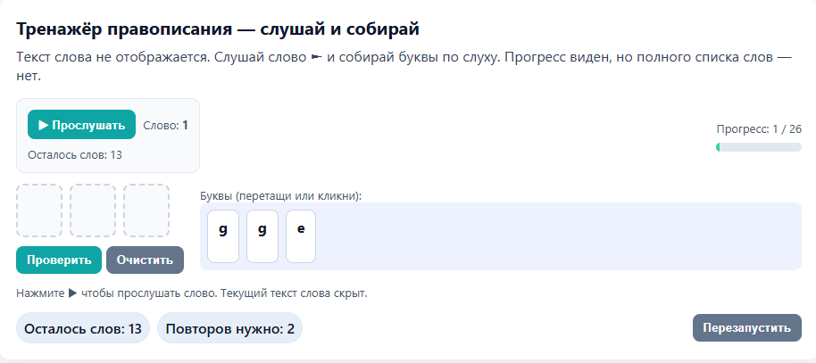
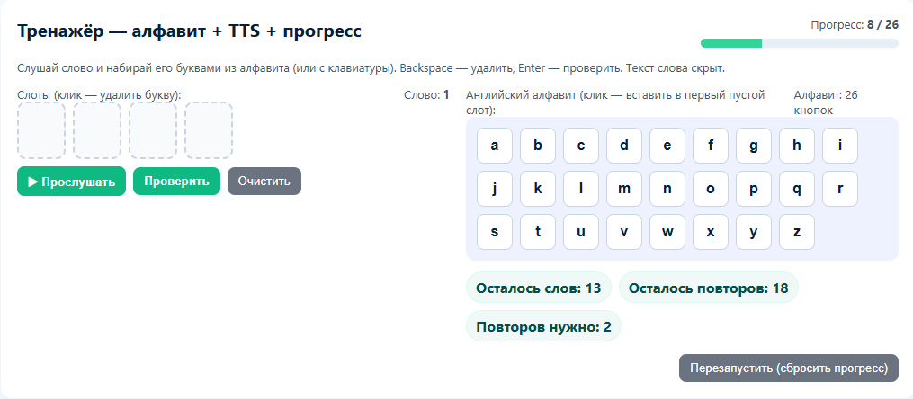

# 📖 Тренажёры по английскому языку (2 класс)

Набор интерактивных тренажёров для изучения английского языка во 2-м классе.  
Упражнения разработаны на основе учебника:  

**«Английский язык. 2 класс», серия «Английский в фокусе»  
(авторы: Н. И. Быкова, Дж. Дули, М. Д. Поспелова, В. Эванс)**  

---

## 🚀 Что внутри
В репозитории — HTML-страницы с упражнениями для изучения алфавита и слов.

Все задания основаны на **аудио-подсказках (TTS)** и интерактивных элементах: буквы можно выбирать кликом или вводить с клавиатуры.  
---

## 📸 Скриншоты

### Главная - выбор упражнения


### Ввод слова из списка букв


### Ввод слова из всего алфавита


---

## 🔧 Как запустить
1. Склонируйте репозиторий:
   ```bash
   git clone https://github.com/dnovichkov/english_training.git
   ```
2. Откройте нужный .html-файл в браузере (двойным кликом или через File → Open).

3. Прогресс сохраняется в localStorage, поэтому при повторном запуске продолжается с последнего места.

## 💡 Особенности

* Полная поддержка английского алфавита.

* Проверка написания слов и подсветка ошибок.

* Случайный порядок слов с обязательным повторением до полного усвоения.

* Сохранение прогресса между сессиями.

## 📌 Для кого

* Ученики 2 класса.

* Родители, которые помогают детям учить английский.

* Учителя, которым нужны готовые онлайн-упражнения для уроков.
